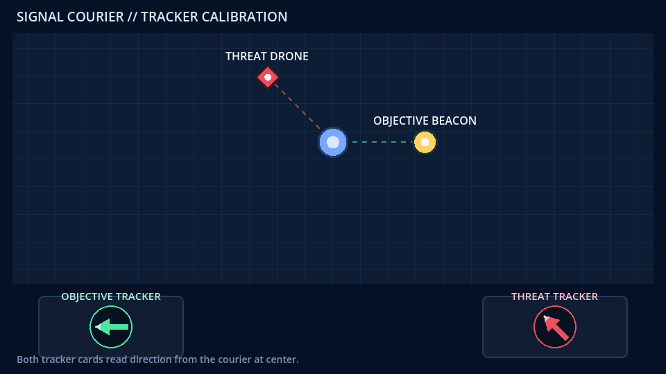
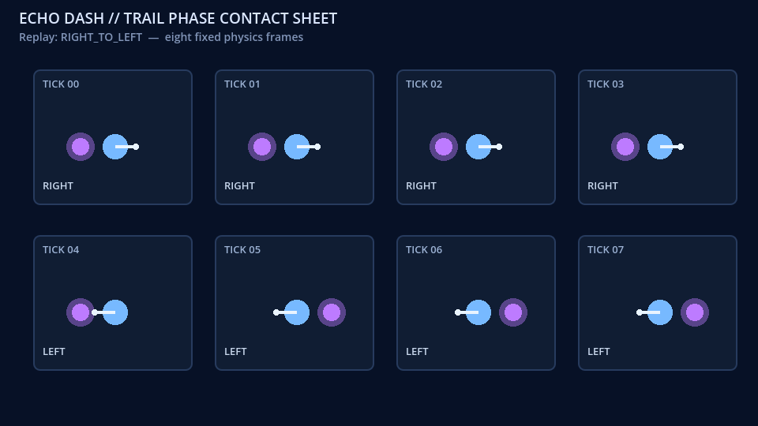
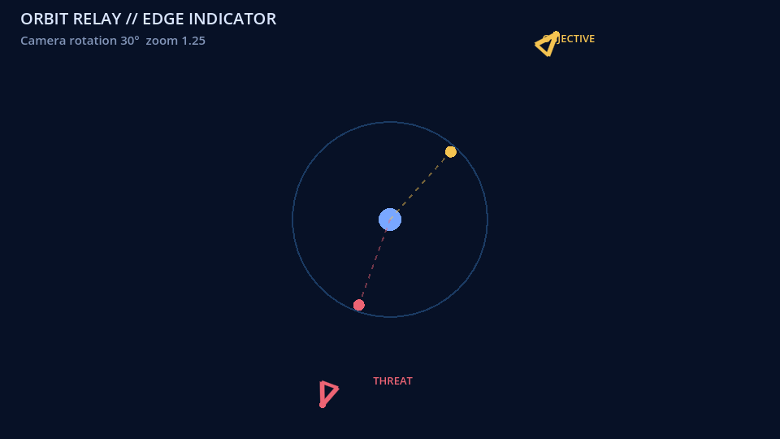
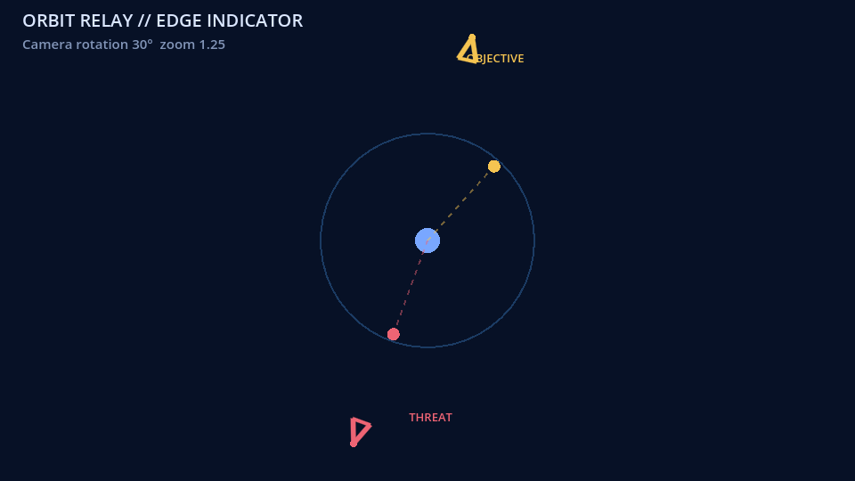

# GameVisualFix 项目最终汇报

本文汇总 GameVisualFix 的调研、任务设计、评测流程和实验结果。

## 1. 项目结论

本项目围绕游戏视觉调试搭建了一套完整的编程智能体评测流程，包括前期调研、原创 Godot 任务、公开与隐藏数据隔离、统一控制器、运行截图、隐藏自动评分、模型轨迹、失败分类和结果汇总。

最终 v2.1 矩阵包含三道任务和两个模型，共六次有效标准评测运行：

| 模型 | T001 | T002 | T003 | 成功率 | 平均总分 |
| --- | ---: | ---: | ---: | ---: | ---: |
| Seed Evolving（`doubao-seed-evolving`） | 100 | 100 | 100 | 3/3 | 100.000 |
| 本地 Codex（`gpt-5.6-sol`） | 100 | 0 | 100 | 2/3 | 66.667 |

Seed 三题均完成补丁、重新运行观察、运行检查、提交和隐藏评测。本地 Codex 的 T002 是有效模型失败：它没有写入补丁，观察两次后直接提交，18 个隐藏测试用例全部保留原始缺陷，因此功能、视觉和回归得分均为 0。六次结果全部为有效标准运行（`valid_canonical`）；历史基础设施无效记录没有混入指标。

由于样本量有限，这些结果用于描述本轮实验中的模型表现，不用于推断统计显著性、稳定性或广泛模型排名。

## 2. 背景与研究问题

现有编程智能体评测通常关注文字问题描述、代码测试或最终补丁。GameVisualFix 进一步观察模型如何利用游戏运行画面完成代码修复：

`初始运行画面 -> 仓库检索与定位 -> 代码修改 -> 新进程运行 -> 新截图 -> 验证或恢复 -> 隐藏评测`

核心问题是：智能体能否根据运行时视觉证据完成仓库级修复，而不只依赖文字描述或静态代码。评测同时记录视觉识别、代码定位、编辑、运行验证和失败恢复等环节，以可审计轨迹和确定性判定规则解释结果差异。

相关研究已经覆盖游戏开发智能体、多模态软件修复和视觉交互评测。文献调研包括 GameDevBench、GameCraft-Bench、GameEngineBench、SWE-bench Multimodal、VisualAgentBench、GUIRepair、SVRepair、MM-IssueLoc、CodeV、FailureMem 和 CUADebug，详细来源见 [`research/literature_review.md`](research/literature_review.md) 与 [`research/gap_analysis.md`](research/gap_analysis.md)。在此基础上，GameVisualFix 将运行画面、现有游戏仓库修复、重新观察、隐藏多条件判定规则和恢复过程组织在同一条可复核流程中。

## 3. 数据集与任务设计

三道任务都不是从空目录生成游戏，而是在已有 Godot 项目中修复一个可运行的视觉或行为缺陷。公开工作区只提供任务描述、代码、资源和初始证据；参考补丁、隐藏测试用例、判定规则与评测器在智能体进程结束后才使用。

| 任务 | 难度标签 | 任务示例 | 隐藏判定规则 | 测试用例数 |
| --- | --- | --- | --- | ---: |
| T001 信号信使（Signal Courier） | 简单 | 修正两个界面指示器的目标方向，同时保持移动目标和窗口尺寸变化下的行为。 | 5 个方向 × 2 个视口，检查方向、几何像素、动态更新、布局和资源完整性。 | 10 |
| T002 轨道中继（Orbit Relay） | 中等 | 修正相机空间边缘指示器，同时保持另一个指示器以及相机和玩家的正常行为。 | 3 种相机旋转 × 2 种缩放 × 3 个视口，检查目标方向、威胁可见性和无干扰截图。 | 18 |
| T003 回声冲刺（Echo Dash） | 困难 | 在方向变化和中断情况下让时序轨迹始终位于正确一侧。 | 6 种固定物理帧回放 × 2 种物理帧率，每次回放生成固定帧序列图。 | 12 |

### 任务画面示例

下图是三道任务提供给模型的初始运行证据。点击图片可查看原始尺寸。

| T001 信号信使 | T002 轨道中继 | T003 回声冲刺 |
| --- | --- | --- |
|  |  |  |
| 右侧信标位于角色右方，但底部绿色目标指示器指向左侧。 | 黄色目标边缘指示器的朝向与相机空间中的目标关系不一致。 | 在第 4 帧发生方向切换时，紫色轨迹仍留在角色前侧。 |

### 为什么任务规模较小仍有价值

任务规模小源于第一阶段（P0）的隔离变量设计。小型项目可以减少资产、引擎和环境噪声，让评测清楚观察：模型是否看到了症状、是否找到决定性文件、是否写入合理补丁、是否请求新的运行证据，以及是否在验证失败后改变策略。

判别性来自隐藏条件而不是补丁行数：多方向、多分辨率、相机旋转、缩放、视口、固定物理帧回放、动态目标、资源完整性和回归行为，可以防止模型只修一个截图或硬编码一个方向。三题也覆盖了静态几何、相机空间关系和时序轨迹三类不同机制。

该数据集定位于低混杂、可复核的端到端修复案例，适合分析评测设计和模型轨迹。它与覆盖大量项目和引擎的大规模排行榜评测集承担不同作用。

## 4. 评价指标与判定规则

每道任务统一使用 100 分：

| 维度 | 分值 | 含义 |
| --- | ---: | --- |
| 功能正确性 | 45 | 运行状态、方向关系、行为逻辑和主要功能测试用例。 |
| 视觉正确性 | 35 | 固定视口、状态和时刻下的方向、几何、可见性或帧序列图检查。 |
| 回归安全性 | 20 | 目标缺陷之外的指示器、相机、输入、动态行为、资源和工程完整性。 |

三部分必须同时满分才会得到任务成功状态（`task_success=true`）；总分不能用其他维度抵消强制失败项。过程指标包括动作序列、控制器动作数、重新运行观察次数、总耗时、交互轮次、词元使用量、终止状态和失败类型。

基础设施有效性优先于分数：模型服务、命令行工具、控制器、渲染器或评测器的可复现故障标记为基础设施无效（`invalid_infrastructure`）；超时、错误动作、错误补丁、预算耗尽和低分都保留为有效模型结果，不重跑。

## 5. 评测流程

1. 每次运行前，从公开初始项目建立独立工作区，并移除 `.git`、`.env`、缓存和隐藏内容。
2. 第一轮将任务说明、初始运行画面 PNG 和严格的控制器动作格式交给模型。
3. 控制器只执行白名单动作：`list_files`（列出文件）、`read_file`（读取文件）、`write_file`（写入文件）、`run_smoke`（运行冒烟检查）、`observe`（重新观察）、`submit`（提交）。
4. 执行 `observe` 时复制当前工作区，启动固定的 Godot 4.7.1 渲染器，生成新的 PNG，并通过显式续接将结果回传给模型。
5. 执行 `submit` 后冻结工作区。智能体进程结束后，隐藏评测器输出功能、视觉和回归三项分数。
6. 正式顺序固定为 T001→T002→T003，每题先运行 Seed、再运行本地 Codex；每个模型与任务组合只接受一次有效标准评测运行。

Seed 请求通过一个仅监听 `127.0.0.1` 随机端口的 Responses 服务器推送事件（SSE）归一化代理，转发到固定的 Seed 智能体服务上游。代理依据 OpenAI Responses 流式事件规范，补齐缺失的数据项、内容片段封装、`added/done` 生命周期事件和单调递增的 `sequence_number`，不改写模型增量文本、推理内容、用量、HTTP 状态或完成状态。遇到未知或畸形数据流时，代理直接拒绝处理。

正式运行前完成了合成探针测试（三张合成图片、长任务说明、两次显式续接）、评测工具固定样例自测，以及三题的导入、冒烟检查、截图和隐藏评测器预检，并运行了代理的标准库单元测试。

## 6. 正式结果

完整机器结果见 [`results/v2_1_seed_proxy_scores.json`](results/v2_1_seed_proxy_scores.json)，对比表见 [`results/v2_1_seed_proxy_comparison.md`](results/v2_1_seed_proxy_comparison.md)。

| 任务 | 模型 | 功能 | 视觉 | 回归 | 总分 | 是否成功 | 动作数 | 重新观察次数 | 耗时（秒） |
| --- | --- | ---: | ---: | ---: | ---: | --- | ---: | ---: | ---: |
| T001 | Seed | 45 | 35 | 20 | 100 | 是 | 5 | 1 | 105.969 |
| T001 | 本地 Codex | 45 | 35 | 20 | 100 | 是 | 8 | 1 | 76.016 |
| T002 | Seed | 45 | 35 | 20 | 100 | 是 | 4 | 1 | 89.188 |
| T002 | 本地 Codex | 0 | 0 | 0 | 0 | 否 | 4 | 2 | 107.485 |
| T003 | Seed | 45 | 35 | 20 | 100 | 是 | 3 | 1 | 111.875 |
| T003 | 本地 Codex | 45 | 35 | 20 | 100 | 是 | 6 | 1 | 80.172 |

### 汇总运行数据

| 模型 | 总动作数 | 成功重新观察次数 | 总耗时（秒） | 输入词元 | 缓存输入词元 | 输出词元 | 推理输出词元 |
| --- | ---: | ---: | ---: | ---: | ---: | ---: | ---: |
| Seed | 12 | 3 | 307.032 | 223,953 | 169,832 | 9,490 | 6,222 |
| 本地 Codex | 18 | 4 | 263.673 | 412,757 | 244,480 | 5,973 | 2,393 |

词元和总耗时是运行统计，不等于最终账单。Seed 总耗时更高，但动作更少；本地 Codex 总耗时较低但动作更多。样本太小，不能把这些差异解释为稳定效率优势。

## 7. 轨迹示例与案例分析

脱敏的动作与观察哈希链位于 [`trajectories/v2_1_seed_proxy/`](trajectories/v2_1_seed_proxy/)，回执不包含模型服务的推理内容、模型正文或文件正文。

T002 是两种模型结果差异最明显的一题。下图使用相同的基准场景（`BASELINE`）：Seed 修改代码后的新观察中，黄色目标指示器已按相机空间关系校正；本地 Codex 的观察仍与初始故障画面一致。

| Seed T002：修复后 | 本地 Codex T002：未修复 |
| --- | --- |
|  |  |
| 完成代码修改、重新观察和公开检查，18 个隐藏测试用例全部通过。 | 两次观察均未伴随代码修改，18 个隐藏测试用例全部失败。 |

### Seed T002：完成闭环

`write_file -> observe -> run_smoke -> submit`

Seed 首先定位并修改相机空间指示器，随后请求新的基准场景观察，运行公开冒烟检查并提交。18 个隐藏测试用例全部通过。该次运行的代理回执记录了 6 条上游数据流，其中 2 条包含无法可靠归一化的 `function_call` 数据项；代理按协议中止这两条数据流，Codex 随后通过既有的数据流重试机制恢复，最终形成完整的 4 轮控制器轨迹。两次恢复均发生在同一次标准评测运行内，该结果仍按原协议记为一次有效标准运行（`valid_canonical`）。

### 本地 Codex T002：有效模型失败

`read_file -> observe -> observe -> submit`

本地 Codex 读取代码后连续请求两次观察，但从未执行 `write_file`。18 个由旋转、缩放和视口组合而成的隐藏测试用例都能正常渲染，但目标指示器没有修复，功能、视觉和回归得分分别为 0/45、0/35、0/20。这个结果说明“能够启动程序和获得截图”不等于“完成仓库修复”，也说明评测器的门控评分能够区分可运行但未修复的提交。

更多逐题说明见 [`results/v2_1_seed_proxy_case_study.md`](results/v2_1_seed_proxy_case_study.md)。

## 8. 成本与资源

### 已知运行成本指标

| 项目 | Seed | 本地 Codex | 备注 |
| --- | ---: | ---: | --- |
| 标准评测运行次数 | 3 | 3 | 每题一次有效运行。 |
| 总耗时 | 307.032 秒 | 263.673 秒 | 三题总和。 |
| 控制器动作数 | 12 | 18 | 包含读取、写入、观察、冒烟检查和提交。 |
| 输入词元 | 223,953 | 412,757 | 模型服务与 Codex 的运行统计。 |
| 缓存输入词元 | 169,832 | 244,480 | 模型服务与 Codex 的运行统计。 |
| 输出词元 | 9,490 | 5,973 | 模型服务与 Codex 的运行统计。 |
| 推理输出词元 | 6,222 | 2,393 | 只记录统计值，不发布推理正文。 |

| 成本项 | 当前值 | 说明 |
| --- | --- | --- |
| Seed 智能体服务或接口金额 | 9元 | Coing Plan 费用 |
| 本地 Codex 订阅或调用金额 | 一周用量 | 包含整个项目设计实验执行 |
| 人工设计、调试和整理工时 | 一天 | 代码和报告中没有完整工时记录。 |
| 设备、显卡、网络和电力成本 | Windows笔记本 | 使用单台本地 Windows 机器，未做成本计量。 |

## 9. 有效性、安全与历史记录

- v2.1 六份运行清单均使用第三版格式、属于同一评测套件、状态为 `submitted`，且评测器正常退出。
- Seed 三题都至少成功完成一次重新运行观察；六条脱敏轨迹共 30 个事件，哈希链与回执一致。
- 旧 v2 Seed 传输层无效记录、旧本地 Codex 适配器路径无效记录和早期失败探针测试，保留在 v2.1 分数 JSON 的 `excluded_lineage` 字段中，不进入 v2.1 汇总结果。
- `.env`、接口密钥、授权请求头（Authorization）、模型服务原始增量文本和推理内容不进入最终文件树；Codex 生命周期日志只保留事件类型、用量和正文哈希，标准运行清单中的提交摘要也仅保留字节数与 SHA-256 指纹。
- 当前公开文件树已移除旧的原始运行正文，但不改写已有 Git 历史；历史提交仍按 Git 原有记录保存。

## 10. 局限与后续建议

1. 每个模型只有三道任务，每个模型与任务组合只有一次有效运行，无法得出统计显著性、方差或稳定性结论。
2. 六个结果中五个达到 100 分，存在明显的天花板效应；本地 Codex 在 T002 上的单次失败不能证明稳定的模型差异。
3. 任务是小型合成 Godot 修复案例，不代表真实大型游戏仓库、其他引擎或长期维护能力。
4. 运行使用单机、单账户、Godot 4.7.1 和 Codex 0.149.0；升级模型服务、命令行工具或渲染器后应创建新的评测套件，不能混入当前套件。
5. 后续可增加布局、动画与瞬态效果、资源管理、多文件重构和真实失败后的恢复任务，并把每题扩展到多次独立运行。
6. 后续实验应统一不同模型的任务说明与图片封装方式、命令行工具版本、模型元数据、沙箱或虚拟机隔离，以及成本账单口径。
