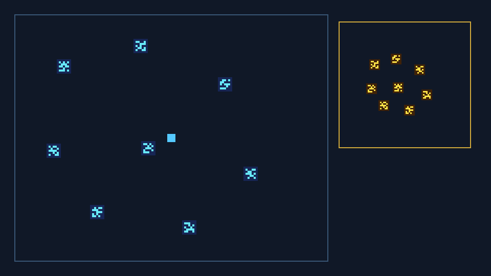
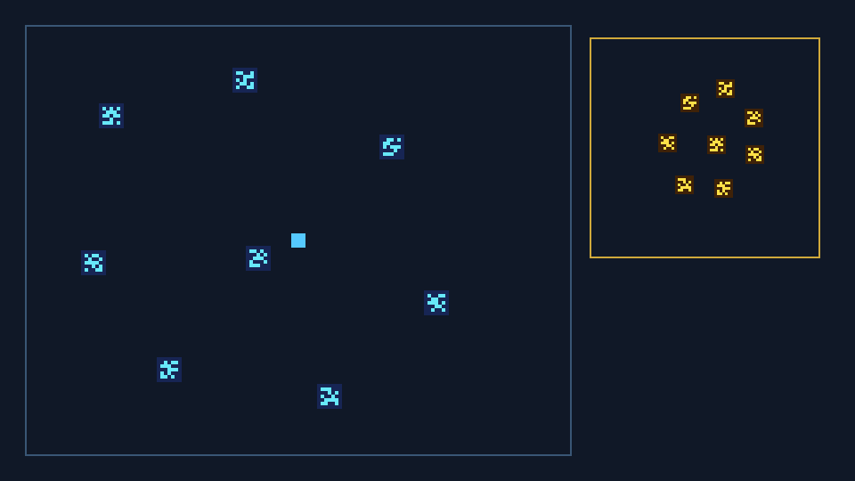
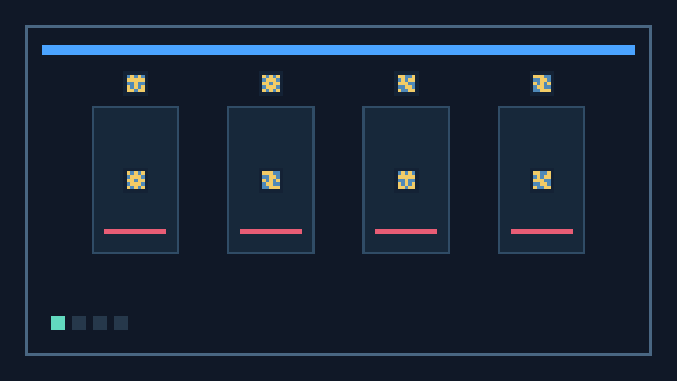
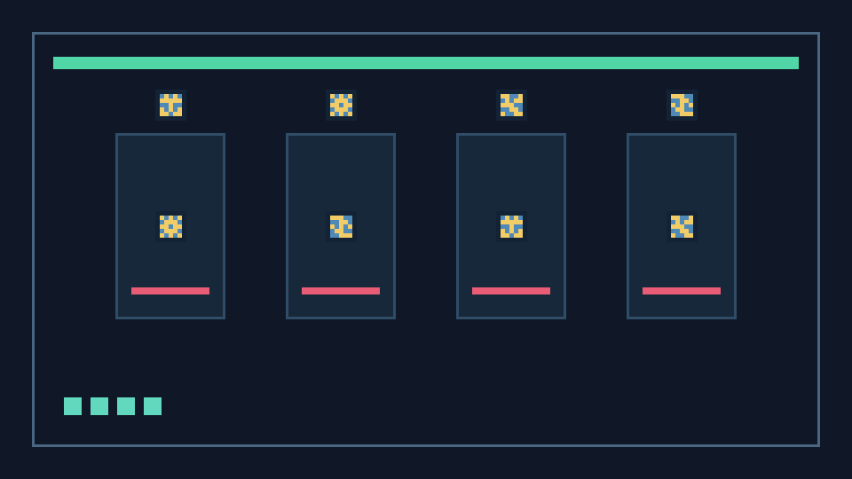
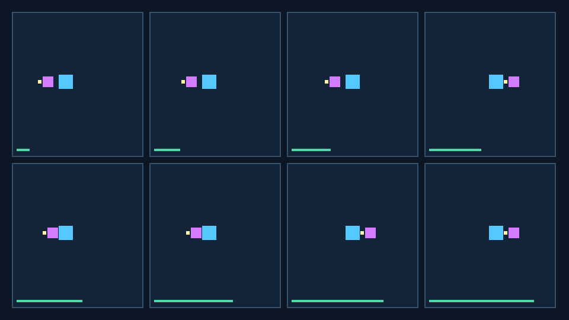
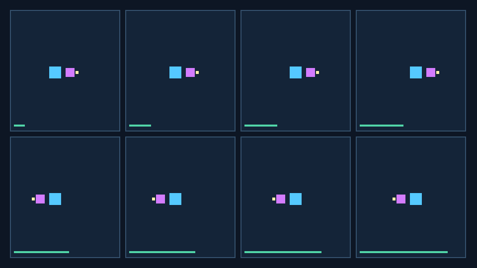

# GameVisualFix v3：Seed 游戏修复能力评测汇报

日期：2026-08-24
实验套件：`gamevisualfix_v3_seed_fulltrace_partialfix_3x1`

## 1. 先说结论

这轮我们不再只考“模型会不会改一行代码”，而是让模型一边看游戏画面、一边读项目文件、一边修改代码，再通过新的画面确认自己是否真的修对。

Seed（`doubao-seed-evolving`）在 3 道题中成功 1 题：

| 任务 | 白话结果 | Functional | Visual | Regression | 总分 | 是否完成 |
| --- | --- | ---: | ---: | ---: | ---: | --- |
| T004 Glyph Atlas | 修了画面旋转逻辑，但没把每个小地图图标和真实地标重新配对 | 25 | 0 | 20 | 45 | 否 |
| T005 Checkpoint Mosaic | 修好了存档链路前半段，但最后忘了早期画面里的关键线索 | 30 | 0 | 20 | 50 | 否 |
| T006 Mirrorstorm | 修好了 Boss 特效在不同阶段“串帧、朝向错位”的问题 | 45 | 35 | 20 | 100 | 是 |

三题成功率为 **1/3（33.3%）**，平均分 **65.0/100**。这是一组单模型、单次运行的案例实验，用来定位能力边界；不能据此给模型做通用排名。

三个分项的意思很简单：

- **Functional**：游戏逻辑和任务功能是否做对。
- **Visual**：实际游戏画面是否真的正确。
- **Regression**：修 Bug 时有没有把原来正常的玩法、界面或资源弄坏。

## 2. 这三道题分别在考什么

### T004：在大地图和小地图里“给图标认主”

玩家在左侧世界地图里能看到 8 个蓝色地标，右侧小地图里有 8 个黄色图标。图标没有文字，只能看形状和位置来判断“哪个黄图标对应哪个蓝地标”。当相机旋转、进入镜像 portal、或窗口大小变化时，小地图也必须保持对应关系。



上图要看的是：左边 8 个蓝色图案是现实中的地标；右边的小地图要用同一组图案关系表达它们。



上图要看的是：地标位置基本还在，但黄色图标的身份配错了，不能只靠“旋转一下地图”解决。

**模型做了什么：** 它读了坐标投影、图标注册和绑定配置，观察了旋转与镜像场景，随后只修改了 rotation/mirror 的执行顺序，并成功跑过公开 smoke test。

**为什么仍失败：** 模型把问题过早判断成“坐标变换顺序错了”。但隐藏评测发现，8 个图标与地标的对应表仍然是错的。因此它修了一半：空间方向部分有改动，图标“认主”部分没有完成，Visual 得分为 0。

### T005：修“老存档接力闯关”

这是一个存档升级问题。玩家第一次在大厅看到 4 扇门和 4 个没有文字的 seal 图案；游戏会保存 checkpoint。之后玩家经过电梯、读取旧存档、回到最终恢复页面时，HUD 必须还能给出正确提示。



上图要看的是：四扇门和它们的 seal 顺序是后续修复的关键线索。模型需要记住这个视觉顺序，不能只看代码里的匿名 slot 名称。



上图要看的是：这是最终恢复阶段。它会检查之前保存、迁移和 HUD 提示是否仍能连成一条正确的链。

**模型做了什么：** 它能够推进 route binding 和部分 v1→v2 存档迁移，所以功能拿到 30 分、回归拿到 20 分。

**为什么仍失败：** 经过多次观察、改代码、推进游戏状态后，模型没有把大厅中看到的 seal 顺序正确带到最后的 HUD 提示。最后一轮调用在预算内超时，因此没有完成最终提交。这说明它在“看见线索 → 长时间记住 → 在后续状态里重新使用”这条链上存在缺口。

### T006：修 Boss 特效“串帧、方向错位”

Boss 冲刺时会显示危险预警特效。正常情况下，特效应该跟随当时那一帧的玩家位置、朝向和场地镜像状态。Bug 出在特效没有保存这一帧的数据，而是在稍后又读取了已经变化的实时状态，所以反向冲刺、镜像阶段或被打断时会短暂画到错误位置。



上图要看的是：连续 8 帧里，紫色预警特效相对玩家和 Boss 的位置、方向会变化；单看最后一帧不够，需要看这一串画面。



上图要看的是：模型修改后重新请求的运行画面。隐藏评测还会继续检查镜像、不同 tick 速率和中断恢复，不只看这一张图。

**模型做了什么：** 它跨 attack controller、不可变 sample、renderer 和对象池多个文件完成修改，并在 17 个 action、2 次 fresh observation 内提交。

**为什么成功：** 隐藏评测在功能、画面和回归三部分均通过。这个结果也很重要：它说明模型并非不能处理动态视觉问题，而是在某些需要跨图对应或长期保存视觉线索的任务上更容易失手。

## 3. 实验怎么保证可信

- 三题都是 Godot 4.7.1 项目；模型只能发 Controller action：查看文件、读取文件、写文件、跑 smoke、请求新截图或提交。
- 模型看不到隐藏 evaluator、Oracle、参考补丁、主仓库和 `.env`；隐藏评测会从干净状态重新运行项目。
- 每题最多 30 个 action、8 次 fresh observation、40 分钟。错误补丁、超时或未提交都是有效模型结果，不会因为分数不好重跑。
- 每题只有一次最终有效的 canonical attempt。T004 早期的传输层无效记录没有混进上述分数。

## 4. 如何查看完整实验轨迹

交付包中已经将三份最终有效轨迹单独整理为：[`gameFix/results/trajectory/`](../gameFix/results/trajectory/)。文件名直接包含任务名、模型名和 `canonical`，便于 leader 快速打开。

每份 `full_trajectory.jsonl` 都是一条完整的 Agent episode，记录：初始 prompt 和图片、模型每一轮实际回复、可用 action schema、Controller 调用和回执、以及 provider/Codex 返回的 reasoning summary（如服务返回）。它不包含合成的 chain-of-thought、API key、Authorization header 或 `.env`。

原始实验目录仍完整保留，方便后续审计；交付包只把三次正式结果复制出来，不移动、不改写原文件。

## 5. 对业务的启发

1. T004 说明，仅让模型“看到了截图”还不够。跨图形状对应与代码中的绑定表需要一起推理，模型可能只修最显眼的坐标逻辑。
2. T005 最值得扩展成数据集：它把视觉记忆、状态推进、存档兼容和最终 UI 验证串在一起，而且每一环都能自动评分。
3. T006 的成功提供了一个健康对照：任务不是故意难到不可完成，强模型确实能解决一部分真实的多文件动态 Bug。

## 6. 交付内容与复现

`gameFix/` 包含三道任务的源文件、Harness、实验结果、完整 canonical 轨迹、截图和本 Markdown 报告。交付仅保留 Markdown；不再包含 PDF 报告。

如需重跑，请在项目根目录配置被忽略的 `.env` 和本机 Godot 4.7.1，再执行：

```powershell
python harness/run_provider_canary.py --provider seed_evolving --godot <godot.exe>
python harness/run_codex_eval.py --task-id task_004 --provider seed_evolving --godot <godot.exe> --output <new-run-directory>
```
